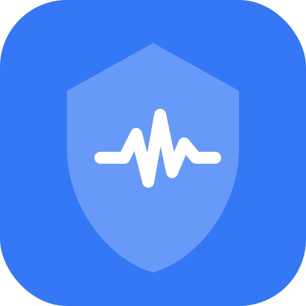

<p align="center">
  
</p>

<h1 align="center">QTShield</h1>

<h3 align="center">Medication safety and cardiac monitoring for people whose hearts can't afford a single mistake</h3>

<h3 align="center">Try it live at <a href="https://qtshield.me" target="_blank">qtshield.me</a></h3>


---

## The Problem

**Long QT Syndrome** affects 1 in 2,500 people. Their heart takes longer than normal to recharge between beats - harmless at rest, fatal when triggered by the wrong drug or the wrong moment. The condition is largely invisible: patients look and feel healthy until the moment they don't.

The danger comes from two directions.

**Medications.** Over **190 common medications** - antibiotics, antidepressants, antihistamines, anti-nausea drugs - can prolong the QT interval and trigger a fatal arrhythmia (Torsades de Pointes). The risk compounds with every combination. Three genetic subtypes (LQT1, LQT2, LQT3) each respond differently, which means a drug that's fine for one patient is dangerous for another.

**The syndrome itself.** Even with correct medications, LQTS patients can go into arrhythmia from their genotype-specific triggers: LQT1 during physical exertion, LQT2 from emotional or physiological stress, LQT3 at rest or during sleep. When it happens, seconds matter. There is no warning, no alarm - just a window between onset and cardiac arrest that closes fast.

**The system fails them every day:**

- A doctor prescribes ciprofloxacin - a routine antibiotic - without knowing it's contraindicated for this patient
- A pharmacist clears each drug individually, missing the compounding interaction between two "low risk" drugs sharing the same metabolic enzyme (CYP3A4)
- A nurse gives ondansetron - standard anti-nausea protocol - not knowing it can kill this specific patient
- A patient has an arrhythmia episode at home, alone, with no one alerted until it's too late
- A patient arrives in an ER abroad with no way to communicate their condition

There is no consumer tool that covers both sides of this problem: preventing dangerous medications and responding when the heart itself starts to fail. QTShield is that tool.

---

## What We Built

A **mobile-first PWA** with five integrated layers - scan drugs before taking them, monitor heart health continuously, and make sure every doctor anywhere in the world has what they need:

- **Instant medication scanning** - type a drug name or photograph the box → immediate RED / YELLOW / GREEN result
- **AI-powered combination analysis** - Claude reasons over CYP450 interactions and genotype-specific risk, not just individual drug flags
- **Multi-source drug resolution** - local database → RxNorm → CredibleMeds → OpenFDA → Claude fallback, with confidence scoring
- **Apple Watch monitoring** - continuous heart health surveillance with an escalating alert chain: arrhythmia onset detected → watch vibrates and notifies the patient → if ignored, emergency contacts are automatically reached
- **Emergency Card in 13 languages** - AI-generated, QR-accessible, no login required - scannable from a phone screen in any ER worldwide
- **SOS response** - simultaneous SMS + voice call + email to all contacts, with GPS location, medication list, genotype, and prohibited drug list
- **AI chat assistant** - knows the patient's full profile, can run scans, look up drugs, and generate documents on demand
- **Specialty-specific Doctor Prep** - a safety brief tailored per visit type (cardiologist, surgeon, dentist, anesthesiologist)

---

## How It Works

### Layer 1 - Apple Watch

The watch is the patient's continuous guardian - both a sensor and a responder.

**What it monitors:** heart rate, HRV, RR interval, stress level, irregular rhythm detection, resting HR, steps, active energy, sleep state - streamed to QTShield over a secure API token.

**What happens when something is wrong:**

1. QTShield detects a threshold crossing - HR spike, rhythm irregularity, HRV drop consistent with arrhythmia onset
2. The watch vibrates and the patient receives an alert - they can confirm they're okay
3. If they don't respond, QTShield automatically triggers the full SOS chain: SMS + voice call + email to all emergency contacts, and a call to local emergency services (911, 112, or the country-specific number) - with GPS location, medication list, and genotype

This escalation loop is the difference between a data dashboard and a safety system. The watch also receives push notifications (APNS) from QTShield in the other direction - when a scan flags a dangerous drug, the patient feels it on their wrist before they take it.

Pairs via 6-digit PIN - no account needed on the watch itself. Watch data flows to the app dashboard via SSE (Server-Sent Events) for real-time display.

### Layer 2 - Web App

Eight screens, built mobile-first as a PWA:

| Screen | What it does |
|---|---|
| Dashboard | Risk overview, recent scans, CYP conflict summary, live watch feed |
| Scan | Type a drug name or photograph a medication box → instant result |
| Medications | Manage current meds; each shows QT risk badge and CYP450 profile |
| Chat | AI assistant that can run scans, look up drugs, and generate documents |
| Emergency Card | Multilingual card with QR code; public link requires no login |
| Doctor Prep | Specialty-specific AI safety brief |
| History | Timeline of all past scans |
| Settings | Profile, genotype, emergency contacts, local emergency numbers |

### Layer 3 - AI (Vercel AI SKD w/ Claude Sonnet 4.6)

Claude is called precisely and sparingly - medical accuracy demands it:

| Situation | Claude calls | Why |
|---|---|---|
| Safe drug scan | **0** | Local lookup only, instant |
| Risky drug, no other meds | **0** | Local data gives the risk category |
| Risky drug + other medications | **1** | Combo analysis + alternatives |
| Photo scan | **1** (Vision) + above | Vision reads the drug name from the image |
| Emergency Card generation | **1** | Structured multilingual card content |
| Doctor Prep generation | **1** | Specialty-aware drug safety brief |
| Chat with tool use | **1 per turn** | Streaming response with tool execution |

Every call uses `temperature: 0` and `generateObject` with Zod validation. Claude receives verified facts - from local DB and external APIs - and reasons. It never looks up risk data itself.

### Layer 4 - Drug Lookup Pipeline

No single source is enough. QTShield runs a waterfall:

```
Input drug name
      │
      ▼
1. Exact match - local database (190+ CredibleMeds drugs, <1ms)
      │  Found → done, no API call
      ▼
2. Fuzzy match on search terms
      │  Found → done, no API call
      ▼
3. RxNorm API → canonical drug name normalization
      ▼
4. CredibleMeds API → authoritative QT risk verification
      ▼
5. OpenFDA → torsades de pointes adverse event signal detection
      ▼
6. Claude AI fallback → marked AI_ASSESSED (not CREDIBLEMEDS_VERIFIED)
      │
      ▼
Result with confidence score (0.0–1.0) + full source pipeline trace
```

### Layer 5 - Emergency Response

When a patient is in crisis:

- **SOS button** sends simultaneous SMS + voice call + email to all emergency contacts
- Each notification includes: patient GPS location, full medication list, genotype, and prohibited drug list
- **Emergency Card** is publicly accessible at `/emergency-card/[slug]` - no login, no account, QR code scannable from a phone screen
- Supported in 13 languages so ER doctors worldwide can read it
- **10-minute SOS cooldown** prevents notification spam

---

## Try It

**Live:** [qtshield.me](https://qtshield.me)

Sign up and test the scan with these drugs:

| Drug | Expected result |
|---|---|
| `Ciprofloxacin` or `Cipro` | 🔴 KNOWN RISK - DTA flag |
| `Moxifloxacin` | 🔴 KNOWN RISK - DTA flag |
| `Ondansetron` | 🔴 KNOWN RISK |
| `Escitalopram` | 🟡 POSSIBLE RISK |
| `Amoxicillin` | 🟢 Safe alternative |

Add two risky drugs to your medication list first - then scan a third - to see Claude's combination analysis and safer alternatives.

---

## Stack

| Layer | Technology |
|---|---|
| Framework | Next.js 15.3 + TypeScript 5.9 (App Router, strict) |
| UI | React 19 + Tailwind CSS v4, mobile-first PWA |
| Database | Prisma 7.5 + Supabase PostgreSQL |
| Auth | Supabase Auth with SSR |
| AI | Vercel AI SDK - `generateObject` + Zod validation |
| Emergency alerts | Twilio (SMS + voice) + Resend (email) |
| Watch | Native watchOS app → custom REST API → APNS push |
| Deploy | Vercel (auto-deploy from main) |

---

## Setup

```bash
git clone https://github.com/x2oreo/HeartBeat
cd HeartBeat
npm install
cp .env.example .env.local
npx prisma db push
npx prisma generate
npm run dev   # http://localhost:3000
```

**Required env vars:**

```env
ANTHROPIC_API_KEY=sk-ant-...
NEXT_PUBLIC_SUPABASE_URL=https://your-project.supabase.co
NEXT_PUBLIC_SUPABASE_ANON_KEY=eyJ...
DATABASE_URL=postgresql://...
DIRECT_URL=postgresql://...

# Emergency notifications (optional)
TWILIO_ACCOUNT_SID=AC...
TWILIO_AUTH_TOKEN=...
TWILIO_PHONE_NUMBER=+1...
RESEND_API_KEY=re_...
```

---

## Why It Matters

LQTS is underdiagnosed. Many patients only discover they have it after surviving a cardiac event - or don't survive at all. For those who are diagnosed, every doctor visit, every prescription, every ER trip is a negotiation with a system that doesn't have their information.

QTShield doesn't replace doctors. It makes sure every doctor - regardless of specialty, country, or language - has what they need to keep this patient safe.
